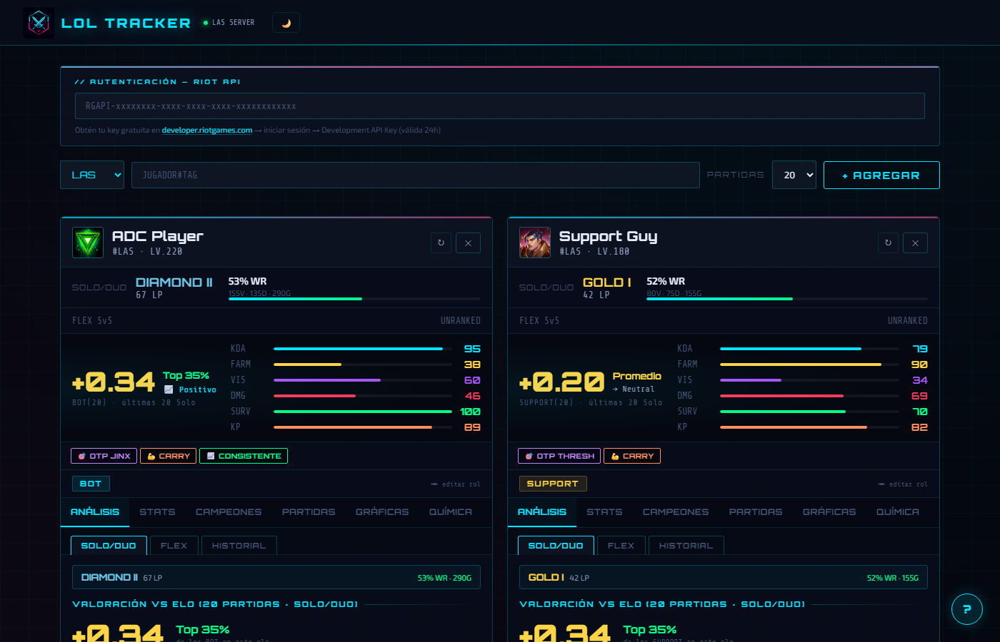
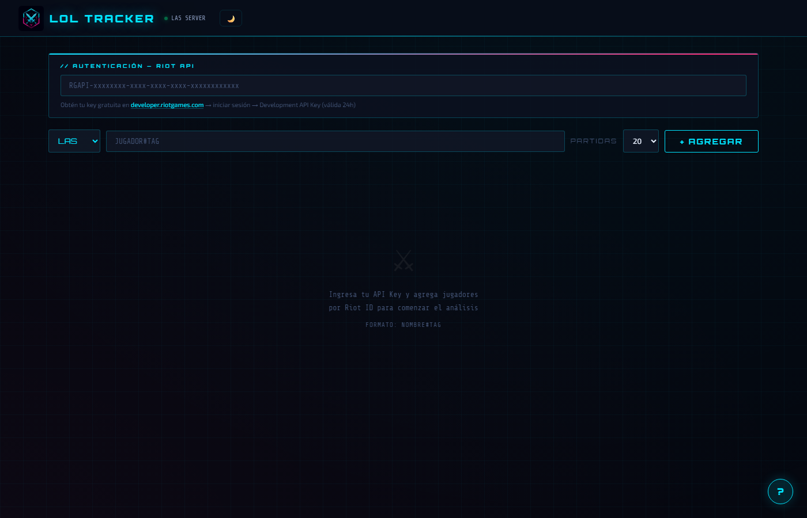
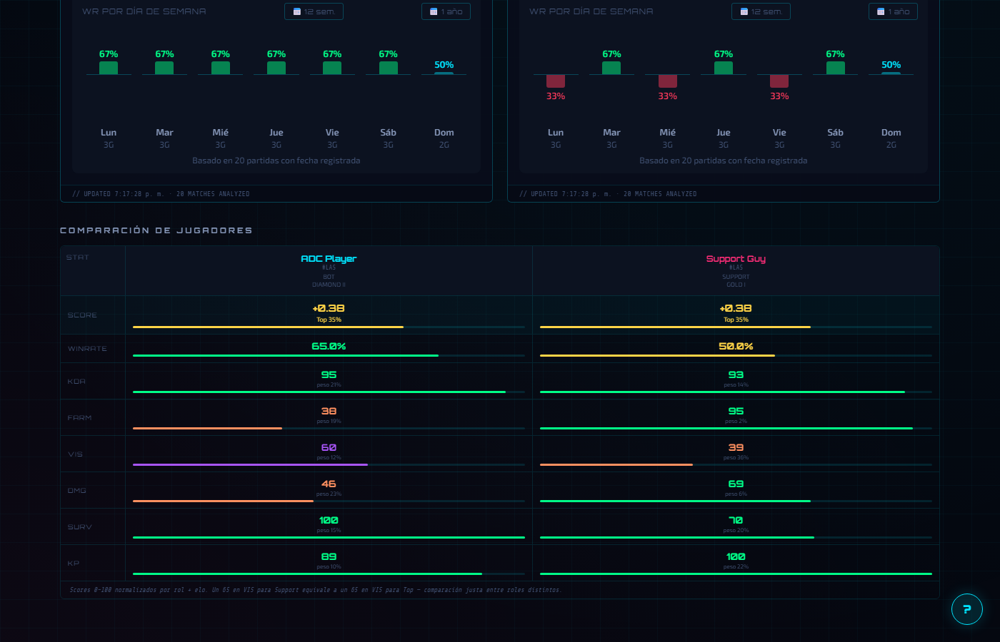

# Nexus Scanner

> [🇬🇧 English](#english) · [🇪🇸 Español](#español)

---

## English

**Nexus Scanner** is a personal performance analysis tool for League of Legends. It fetches your match history via the Riot Games API and breaks down your gameplay across six weighted dimensions — KDA, Farm, Vision, Damage, Survival, and Kill Participation — calibrated by role and rank, so you know exactly what to work on.

🔗 **Live demo:** https://christiangf28.github.io/nexus-scanner/

### Features

- **Role-aware scoring** — each dimension is weighted differently for Support, Jungle, Top, Mid, and Bot
- **Rank-calibrated thresholds** — expectations scale from Iron to Challenger so your score is always contextual
- **El Erudito** — a sarcastic but honest advisor that pinpoints your biggest bottleneck and gives concrete tips
- **Multi-mode tracking** — Solo Queue, Flex, ARAM, Arena, and unranked modes in one place
- **Player comparison** — add multiple players side by side with a radar chart and full stat breakdown
- **12-week / 1-year history** — track your improvement over time with a score sparkline
- **Chemistry tab** — see rank distribution of your most frequent teammates
- **Dark / light mode** — full cyberpunk dark theme and a clean steel-blue light theme
- **No account required** — bring your own Riot API key, everything runs locally in your browser

### How to use

1. Get a [Riot Developer API key](https://developer.riotgames.com/)
2. Open `lol-tracker.html` directly in your browser — no server, no install
3. Paste your API key, select your region, and search for a summoner

### Architecture

Single-file HTML application — all CSS and JavaScript are bundled in one `lol-tracker.html` file. This is an intentional design choice: zero dependencies, no build step, fully portable. Open it locally or deploy it to any static host as-is.

**APIs used:** `account/v1` · `summoner/v4` · `league/v4` · `match/v5`

**Stack:** Vanilla JS · Canvas API · CSS custom properties · localStorage

### Disclaimer

Nexus Scanner is not endorsed by Riot Games and does not reflect the views or opinions of Riot Games or anyone officially involved in producing or managing Riot Games properties. Riot Games and all associated properties are trademarks or registered trademarks of Riot Games, Inc.

---

## Español

**Nexus Scanner** es una herramienta de análisis de rendimiento personal para League of Legends. Obtiene tu historial de partidas a través de la API de Riot Games y desglosa tu juego en seis dimensiones ponderadas — KDA, Farm, Visión, Daño, Supervivencia y Participación en Kills — calibradas por rol y elo, para que sepas exactamente qué mejorar.

🔗 **Demo en vivo:** https://christiangf28.github.io/nexus-scanner/

### Funciones

- **Score por rol** — cada dimensión tiene un peso distinto según tu posición (Support, Jungle, Top, Mid, Bot)
- **Umbrales por elo** — las expectativas escalan de Hierro a Challenger para que el score siempre tenga contexto
- **El Erudito** — un consejero sarcástico pero honesto que identifica tu mayor cuello de botella y da consejos concretos
- **Múltiples modos** — Solo Queue, Flex, ARAM, Arena y normales en un solo lugar
- **Comparativa de jugadores** — añade varios jugadores con radar chart y tabla de stats completa
- **Historial de 12 semanas / 1 año** — sigue tu evolución con un gráfico de progreso
- **Tab Química** — distribución de rangos de tus compañeros más frecuentes
- **Modo claro / oscuro** — tema oscuro cyberpunk y tema claro azul acero
- **Sin cuenta** — usa tu propia Riot API key, todo corre localmente en el navegador

### Cómo usar

1. Obtén una [API key de Riot Developer](https://developer.riotgames.com/)
2. Abre `lol-tracker.html` directamente en tu navegador — sin servidor, sin instalación
3. Pega tu API key, selecciona tu región y busca un invocador

### Arquitectura

Aplicación HTML de un solo archivo — todo el CSS y JavaScript están en `lol-tracker.html`. Es una decisión de diseño intencional: cero dependencias, sin build, totalmente portable. Ábrelo localmente o súbelo a cualquier host estático tal cual.

**APIs utilizadas:** `account/v1` · `summoner/v4` · `league/v4` · `match/v5`

**Stack:** Vanilla JS · Canvas API · CSS custom properties · localStorage

### Aviso legal

Nexus Scanner no está respaldado por Riot Games y no refleja las opiniones de Riot Games ni de ninguna persona involucrada oficialmente en la producción o gestión de las propiedades de Riot Games. Riot Games y todas las propiedades asociadas son marcas comerciales o marcas registradas de Riot Games, Inc.
